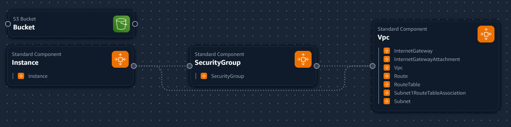

# Short discription

I want to create 2 ec2 instances and 1 s3 bucket so I can save within it.

What I got done step by step:-
----------------------------
    1. first instance
        1.1. Create an instance

        1.2. Create the security group

        1.3. Create vpc 
            1.3.1. Internet Gateway
            1.3.2. Internet Gateway attachment
            1.3.3. vpc
            1.3.4. Route
            1.3.5 Subnet Route table
            1.3.6 Subnet

        1.4. second vpc steps
            1.4.1. Internet Gateway
            1.4.2. Internet Gateway attachment
            1.4.3. vpc
            1.4.4. Route
            1.4.5 Subnet Route table
            1.4.6 Subnet

    2. s3 bucket

----------------------------

# CA brief
% Cloud Technologies CA2

**Deadline:** as displayed on Moodle

**Weight:** 30%

This project is to be done individually.

# Aim

You will analyze a reasonably complex system that you are familiar with (e.g. your final year project) and identify how all/some of it can be deployed on the cloud.
For some of the portions that can be deployed, you will implement parts in CloudFormation. 

# Deliverables

## System description and plan (20%)

In a file `plan.txt`

A description of your system as-is.
This may be taken from an interim report or project proposal.

Identify which parts could be deployed in the cloud, which parts cannot, and the cloud components needed to do so.

## Resource identification (30%)

The CloudFormation file `system.yml` should setup resources needed.
This need NOT be all the resources identified in the previous step, rather just a representative sample.

## Roles (10%)

Creation of roles and permissions for resources identified in `system.yaml`.
Marks will be gained for policies that are specific to the operations and resources required.

## Outputs (10%)

Identification of and outputs of required data for someone using the template.
(e.g. IP addresses for EC2 instances). 

## Setup file (20%)

The setup file should create a stack from your cloudformation file, and should be called `setup.ps1`.

It should carry out any other setup activities pre/post the stack creation. 

## Teardown file (10%)

Teardown file should remove all created resources `teardown.ps1`. 

# Checking your submission for compliance

Your work should be checked using the `ca2_checks.ps1` file that will check your submission for compliance with the required files and naming.
Files that are mis-named or in the wrong format will receive a zero mark.

# How to submit your work

You will submit your work by means of a git repository on https://gitlab.comp.dkit.ie named cloud_ca2.
You must give grantp developer access to your repository. 
Repositories will be cloned for grading after the submission date. 
You do not need to submit anything to the assignment on Moodle. 

# Feedback

Summary feedback will be given on Moodle.
Verbal feedback is available during consultation.
